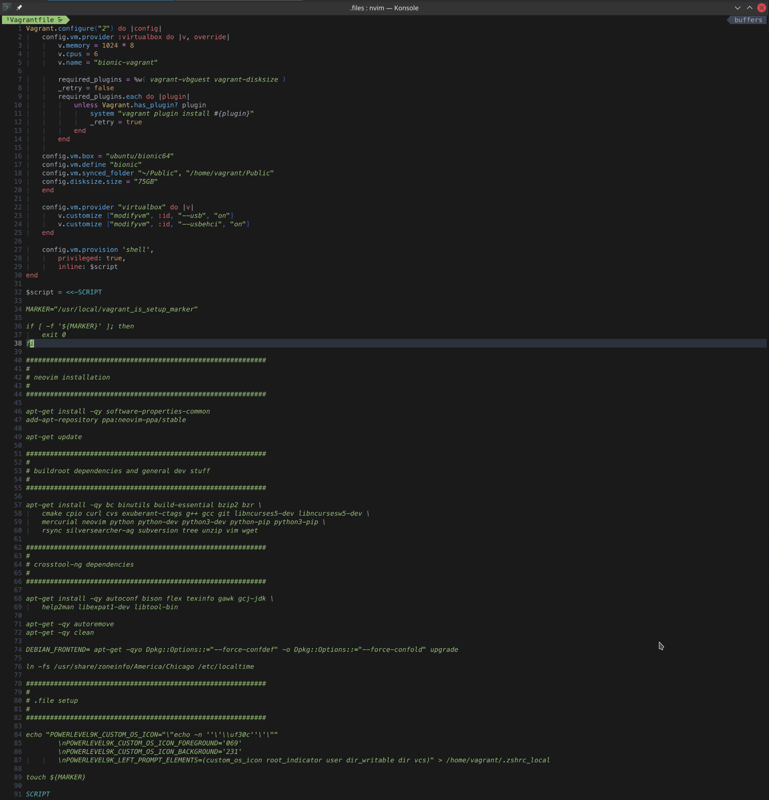

# Getting Started

1. run `. ~/.file/bin/install.sh`
2. next symlink everything to its proper place with `./symlink.sh`
3. reboot terminal and you'll be good to go
4. tip, for os specific things utilize a `.zshrc_local`
5. also install `nvim` if you're privy

# Screenshots

