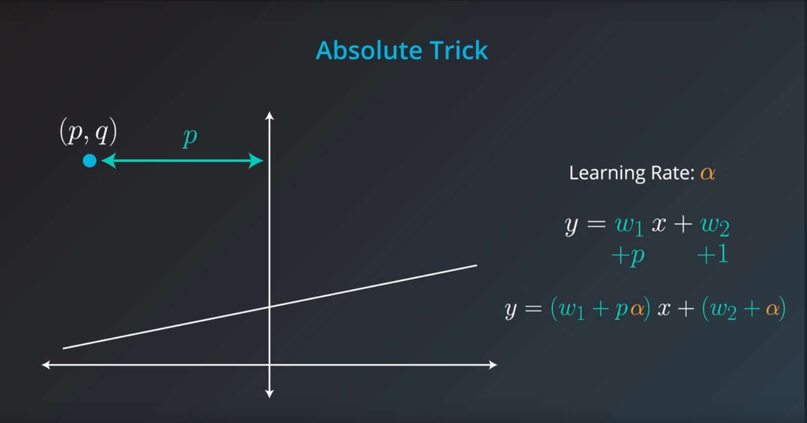
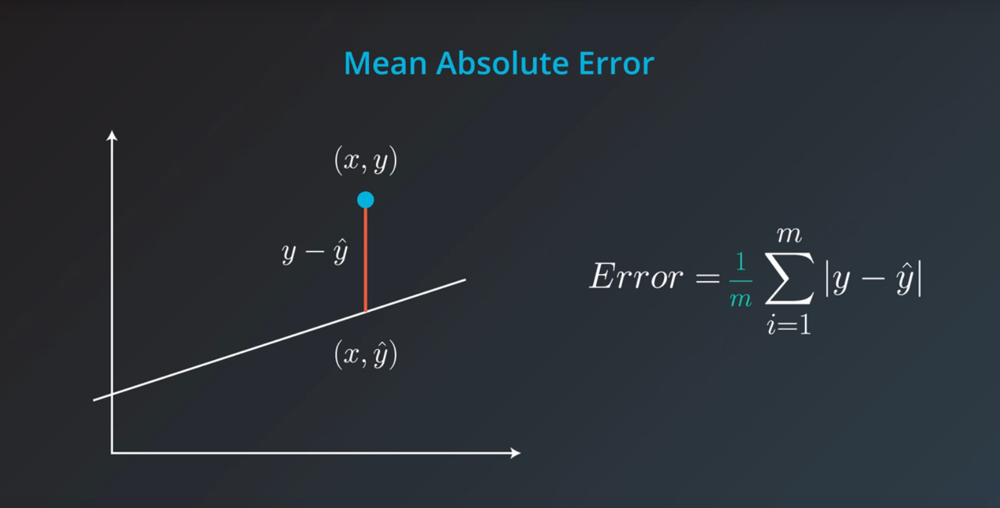
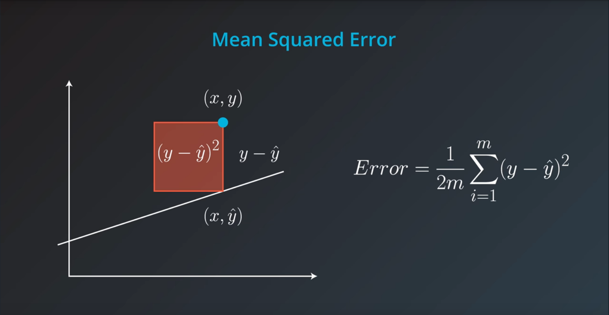
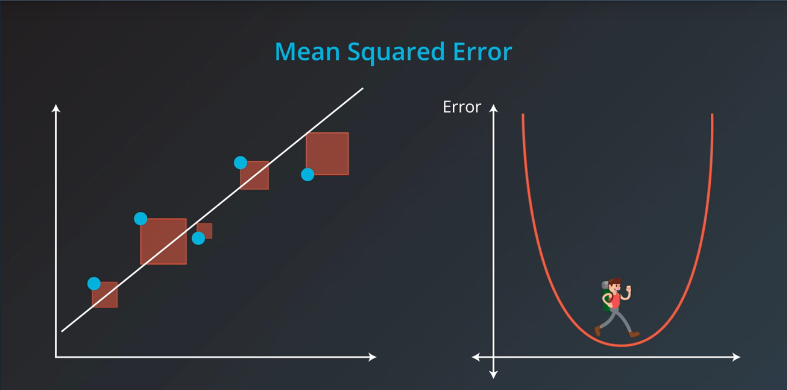
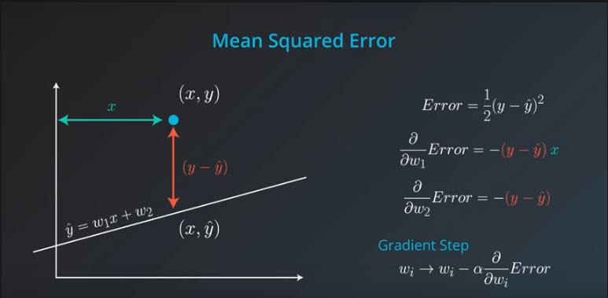
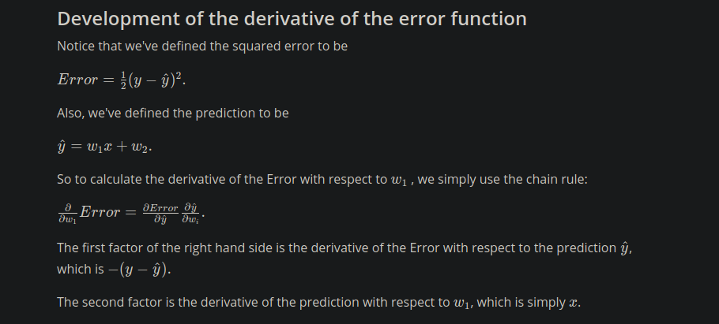
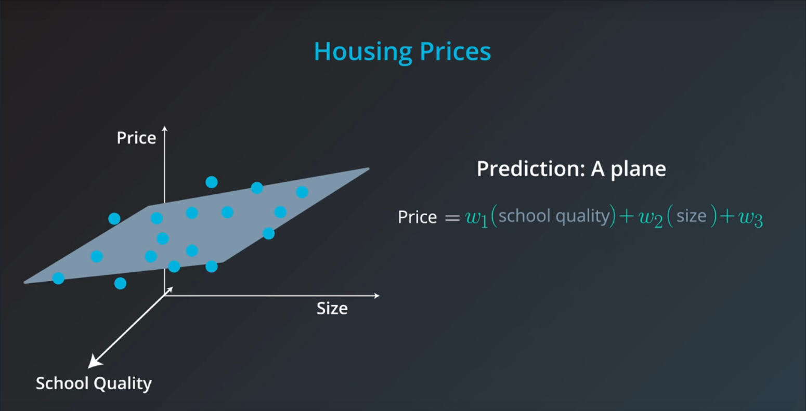
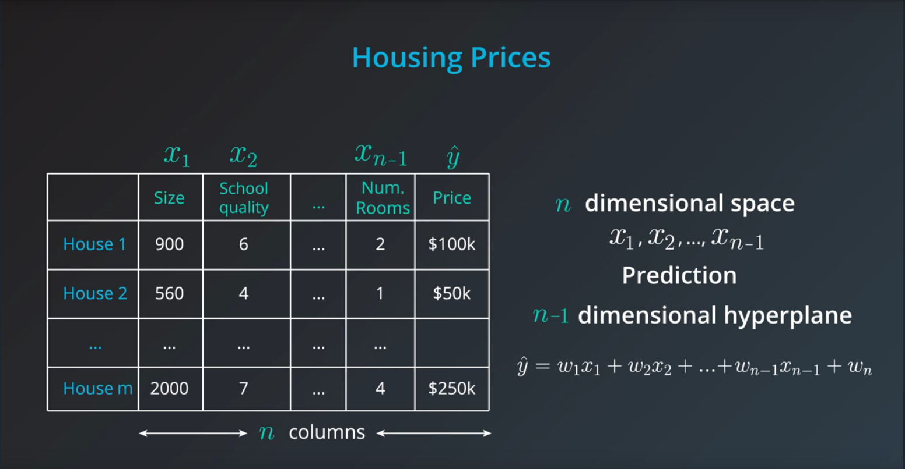

# Linear Regression for Supervised Learning

Linear Regression or line of best fit.

y = mx + b

* b is the intercept
* m is the slope

## Absolute Trick

 If the point is above the line.

 If the point is below the line.


## Squared Trick


## Gradient Descent

To intuitively think about this, lets say we write and algorithm that draws a
line and calculates the error from the line to our data points. The algorithm
then moves the line around and tries to minimize the measured error. This is
done via *Gradient Descent*. 


We can minimize an error function by walking along the negative of its gradient.
The two most common error functions for linear regression are:

* mean absolute error
* mean squared error

### Mean Absolute Error


The goal of this error function is trying to minimize the distance of a point
from the line. The mean absolute error is the average of all aboslute error, or
in other words, the sum of all these absolute values divided by the number of
points *m*.

### Mean Squared Error



The goal of this error function is trying to minimize the area of squares based
on the distance to a point from the line. Minimizing the area of the squares is
exactly the same as walking down the negative gradient.



### Minimizing Error Functions

In summary the error functions are just a gradient step applied to the absolute
and squared trick.




Therefore, the derivative is:


## Batch vs Stochastic Gradient Descent

At this point, it seems that we've seen two ways of doing linear regression.

* By applying the squared (or absolute) trick at every point in our data one by
  one, and repeating this process many times.
* By applying the squared (or absolute) trick at every point in our data all at
  the same time, and repeating this process many times.

More specifically, the squared (or absolute) trick, when applied to a point,
gives us some values to add to the weights of the model. We can add these
values, update our weights, and then apply the squared (or absolute) trick on
the next point. Or we can calculate these values for all the points, add them,
and then update the weights with the sum of these values.

The latter is called batch *gradient descent*. The former is called *stochastic
gradient descent*.


The question is, which one is used in practice?

Actually, in most cases, neither. Think about this: If your data is huge, both
are a bit slow, computationally. The best way to do linear regression, is to
split your data into many small batches. Each batch, with roughly the same
number of points. Then, use each batch to update your weights. This is still
called mini-batch gradient descent.


```python
import numpy as np
# Setting a random seed, feel free to change it and see different solutions.
np.random.seed(42)


# TODO: Fill in code in the function below to implement a gradient descent
# step for linear regression, following a squared error rule. See the docstring
# for parameters and returned variables.
def MSEStep(X, y, W, b, learn_rate = 0.005):
    """
    This function implements the gradient descent step for squared error as a
    performance metric.
    
    Parameters
    X : array of predictor features
    y : array of outcome values
    W : predictor feature coefficients
    b : regression function intercept
    learn_rate : learning rate

    Returns
    W_new : predictor feature coefficients following gradient descent step
    b_new : intercept following gradient descent step
    """
    
    # Fill in code

    # compute errors
    y_pred = np.matmul(X, W) + b
    error = y - y_pred
    
    # compute steps
    W_new = W + learn_rate * np.matmul(error, X)
    b_new = b + learn_rate * error.sum()
    return W_new, b_new


# The parts of the script below will be run when you press the "Test Run"
# button. The gradient descent step will be performed multiple times on
# the provided dataset, and the returned list of regression coefficients
# will be plotted.
def miniBatchGD(X, y, batch_size = 20, learn_rate = 0.005, num_iter = 25):
    """
    This function performs mini-batch gradient descent on a given dataset.

    Parameters
    X : array of predictor features
    y : array of outcome values
    batch_size : how many data points will be sampled for each iteration
    learn_rate : learning rate
    num_iter : number of batches used

    Returns
    regression_coef : array of slopes and intercepts generated by gradient
      descent procedure
    """
    n_points = X.shape[0]
    W = np.zeros(X.shape[1]) # coefficients
    b = 0 # intercept
    
    # run iterations
    regression_coef = [np.hstack((W,b))]
    for _ in range(num_iter):
        batch = np.random.choice(range(n_points), batch_size)
        X_batch = X[batch,:]
        y_batch = y[batch]
        W, b = MSEStep(X_batch, y_batch, W, b, learn_rate)
        regression_coef.append(np.hstack((W,b)))
    
    return regression_coef


if __name__ == "__main__":
    # perform gradient descent
    data = np.loadtxt('data.csv', delimiter = ',')
    X = data[:,:-1]
    y = data[:,-1]
    regression_coef = miniBatchGD(X, y)
    
    # plot the results
    import matplotlib.pyplot as plt
    
    plt.figure()
    X_min = X.min()
    X_max = X.max()
    counter = len(regression_coef)
    for W, b in regression_coef:
        counter -= 1
        color = [1 - 0.92 ** counter for _ in range(3)]
        plt.plot([X_min, X_max],[X_min * W + b, X_max * W + b], color = color)
    plt.scatter(X, y, zorder = 3)
    plt.show()
```

## Linear Regression in scikit-learn
Linear Regression

In this section, you'll use linear regression to predict life expectancy from
body mass index (BMI). Before you do that, let's go over the tools required to
build this model.

For your linear regression model, you'll be using scikit-learn's
`LinearRegression` class. This class provides the function `fit()` to fit the
model to your data.

```python from sklearn.linear_model import LinearRegression model =
LinearRegression() model.fit(x_values, y_values) ```

In the example above, the model variable is a linear regression model that has
been fitted to the data x_values and y_values. Fitting the model means finding
the best line that fits the training data. Let's make two predictions using the
model's predict() function.

```python print(model.predict([ [127], [248] ])) [[438.94308857, 127.14839521]]
```

The model returned an array of predictions, one prediction for each input array.
The first input, [127], got a prediction of 438.94308857. The second input,
[248], got a prediction of 127.14839521. The reason for predicting on an array
like [127] and not just 127, is because you can have a model that makes a
prediction using multiple features. We'll go over using multiple variables in
linear regression later in this lesson. For now, let's stick to a single value.
Linear Regression Quiz

In this quiz, you'll be working with data on the average life expectancy at
birth and the average BMI for males across the world. The data comes from
Gapminder.

The data file can be found under the "bmi_and_life_expectancy.csv" tab in the
quiz below. It includes three columns, containing the following data:

* **Country** – The country the person was born in.  
* **Life expectancy** – The average life expectancy at birth for a person in
  that country.  
* **BMI** – The mean BMI of males in that country.

You'll need to complete each of the following steps:

1. Load the data

>* The data is in the file called "bmi_and_life_expectancy.csv".
>* Use pandas `read_csv` to load the data into a dataframe (don't forget to
>  import pandas!)
>* Assign the dataframe to the variable `bmi_life_data`.

2. Build a linear regression model

>* Create a regression model using scikit-learn's `LinearRegression` and assign
>  it to `bmi_life_model`.
>* Fit the model to the data.

3. Predict using the model

>* Predict using a BMI of 21.07931 and assign it to the variable
>  `laos_life_exp`.

```python
# TODO: Add import statements
from pandas import read_csv
from sklearn.linear_model import LinearRegression

# Assign the dataframe to this variable. 
# TODO: Load the data
bmi_life_data = read_csv("bmi_and_life_expectancy.csv") 

# Make and fit the linear regression model
# TODO: Fit the model and Assign it to bmi_life_model
bmi_life_model = LinearRegression()
bmi_life_model.fit(bmi_life_data['BMI'], bmi_life_data['Life expectancy'])

# Make a prediction using the model
# TODO: Predict life expectancy for a BMI value of 21.07931
laos_life_exp = bmi_life_model.predict(21.07931)

```

## Higher Dimensions



